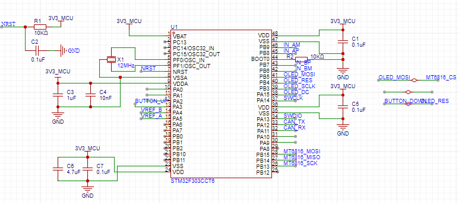
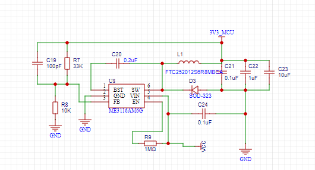
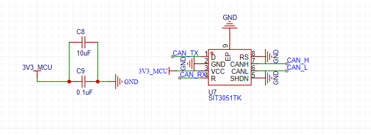
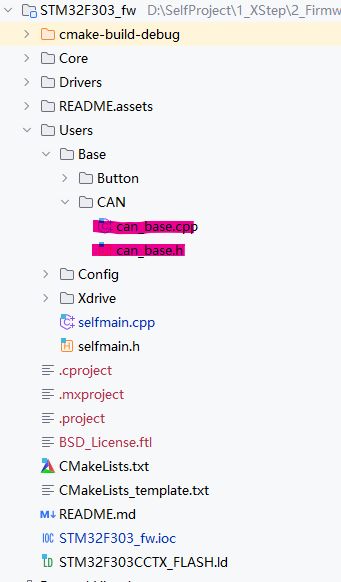
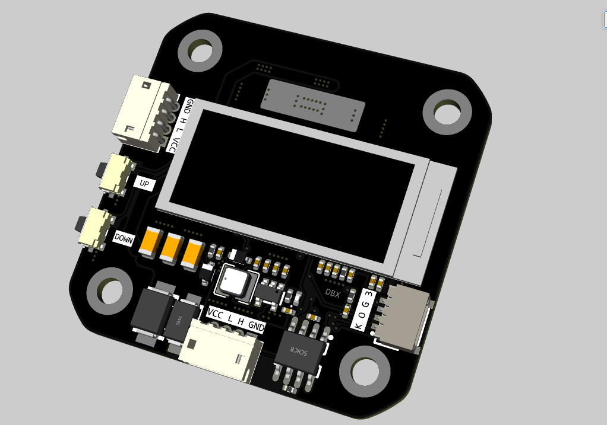

# 20步进电机闭环驱动

## 项目来源

项目参考了[XDrive](https://github.com/unlir/XDrive)和[稚晖君的Dummy](https://github.com/peng-zhihui/Dummy-Robot)内部的20步进电机工程。

固件是在稚晖君42步进电机（与20电机通用）的程序上改进的。

## 更新部分

此处与稚晖君版本的作比较。

1. MCU部分由STM32F102CBT6更换为STM32F303CCT6。

   

   - 内部flash翻倍（现在是256KB），原版的128KB在使用新版的`gcc`编译的时候会内存溢出（由于磁编码器需要校准，占用了32KB）。
   - 驱动器的电压控制直接使用DAC生成，不使用二阶低通滤波，硬件减少。
   - 由于flash翻倍了，可以在42步进电机上面增加一块Oled屏幕（XDrive上面有一块Oled屏幕，稚晖君版本上面预留了Oled的接口，但是flash已经完全用完了）。

2. DCDC部分直接降压到3.3V，取消LDO

   

   - 没啥好说的。。。我就是懒得再焊LDO
   - Boost的自举电容需要0.2uF以上，原版使用了两个0402-0.1uF并联，这里直接使用0603-0.22uF，所占用面积差不多。
   - 分压电阻那可以再精细一点，当前输出的电压大约是3.4V。

3. CAN芯片由TJA1050更换为SIT3051

   

   - 小且便宜

## 使用

固件是在稚晖君的固件上面进行修改，使用Clion进行的烧写。（[Clion的教程在这里](https://zhuanlan.zhihu.com/p/145801160)）下载接口、电源接口、CAN接口都是焊盘连接。

- 按键按下通电程序会自动进行校准，校准完成后按下按键进入位置闭环，自动归零。
- 拨动开关是CAN信号120Ω的开关。
- 校准完后，我使用的是稚晖君的UltraLink里面的步进电机调试器，进行位置和速度的查看。（42步进电机版本加上了Oled屏幕可以直接查看）

- CAN信号控制指令可以在`can_base.cpp`中查看（如果有需要之后可以更新一下）

  

- 附一张42步进电机的驱动板，市面上的42步进闭环驱动其实很丰富了，张大头和创客都做的很好，后续再开（肯定不是因为懒）

​	